# Class Diagram

```mermaid
classDiagram
    class AuthController {
      +signup(req, res)
      +login(req, res)
      +refresh(req, res)
      +me(req, res)
    }

    class AuthService {
      -authRepository: AuthRepository
      +signup(input)
      +login(input)
      +refresh(token)
      +getCurrentUser(userId)
    }

    class AuthRepository {
      +findUserByEmail(email)
      +findUserById(userId)
      +createOrganizationWithOwner(input)
    }

    class AgentsController {
      +listAgents(req, res)
      +getAgent(req, res)
      +createAgent(req, res)
      +updateAgent(req, res)
      +addAllowedDomain(req, res)
      +deleteAllowedDomain(req, res)
    }

    class AgentsService {
      -agentsRepository: AgentsRepository
      +listAgents()
      +getAgent(agentId)
      +createAgent(input)
      +updateAgent(agentId, input)
      +addAllowedDomain(agentId, domain)
      +deleteAllowedDomain(agentId, domainId)
      +getAgentByPublicKey(agentKey)
    }

    class AgentsRepository {
      +ensureDefaultOrganization()
      +listAgents()
      +findAgentById(agentId)
      +findAgentByPublicKey(agentKey)
      +createAgent(input)
      +updateAgent(agentId, input)
      +listAllowedDomains(agentId)
      +addAllowedDomain(agentId, domain)
      +deleteAllowedDomain(agentId, domainId)
    }

    class DocumentsController {
      +listDocuments(req, res)
      +getDocument(req, res)
      +uploadDocument(req, res)
      +deleteDocument(req, res)
      +reindexDocument(req, res)
    }

    class DocumentsService {
      -documentsRepository: DocumentsRepository
      +listDocuments(agentId)
      +getDocument(agentId, documentId)
      +uploadDocument(input)
      +deleteDocument(agentId, documentId)
      +reindexDocument(agentId, documentId)
    }

    class DocumentsRepository {
      +findAgentScope(agentId)
      +listDocuments(agentId)
      +findDocument(agentId, documentId)
      +createDocument(input)
      +deleteDocument(agentId, documentId)
    }

    class ChatController {
      +sendPlaygroundMessage(req, res)
      +getPlaygroundConversation(req, res)
      +sendWidgetMessage(req, res)
    }

    class ChatService {
      -chatRepository: ChatRepository
      +sendPlaygroundMessage(input)
      +sendWidgetMessage(input)
      +getPlaygroundConversation(agentId, conversationId)
    }

    class ChatRepository {
      +findAgentScopeById(agentId)
      +findAgentScopeByPublicKey(agentKey)
      +findConversation(agentId, conversationId)
      +createConversation(input)
      +listMessages(conversationId, limit)
      +insertMessage(input)
    }

    class RetrievalOrchestrator {
      -embeddingProvider: EmbeddingProvider
      -chatModelProvider: ChatModelProvider
      -vectorSearchRepository: VectorSearchRepository
      +run(request)
    }

    class VectorSearchRepository {
      <<interface>>
      +hybridSearch(input)
    }

    class EmbeddingProvider {
      <<interface>>
      +embedQuery(input)
      +embedDocuments(input)
    }

    class ChatModelProvider {
      <<interface>>
      +generateText(prompt)
    }

    class PostgresVectorSearchRepository
    class BedrockEmbeddingProvider
    class BedrockChatModelProvider

    class AnalyticsController {
      +getSummary(req, res)
      +getTopQuestions(req, res)
    }

    class AnalyticsService {
      -analyticsRepository: AnalyticsRepository
      +getSummary(agentId)
      +getTopQuestions(agentId)
    }

    class AnalyticsRepository {
      +getSummary(agentId)
      +getTopQuestions(agentId)
    }

    class ConversationsController {
      +listConversations(req, res)
      +getConversation(req, res)
    }

    class ConversationsService {
      -conversationsRepository: ConversationsRepository
      +listConversations(agentId)
      +getConversation(agentId, conversationId)
    }

    class ConversationsRepository {
      +listConversations(agentId)
      +getConversation(agentId, conversationId)
    }

    class DocumentIngestionService {
      -embeddingService: EmbeddingService
      -textExtractor: DocumentTextExtractor
      -documentChunker: DocumentChunker
      +ingest(input)
    }

    class AnalyticsAggregationService {
      +processMapJob()
      +processReduceJob()
    }

    class ChatAnalyticsLogService {
      +store(input)
    }

    class EmbeddingService {
      +embedDocuments(input)
    }

    class DocumentTextExtractor {
      +extract(storagePath, mimeType)
    }

    class DocumentChunker {
      +chunk(text)
    }

    AuthController --> AuthService
    AuthService --> AuthRepository
    AgentsController --> AgentsService
    AgentsService --> AgentsRepository
    DocumentsController --> DocumentsService
    DocumentsService --> DocumentsRepository
    ChatController --> ChatService
    ChatService --> ChatRepository
    ChatService --> RetrievalOrchestrator
    RetrievalOrchestrator --> EmbeddingProvider
    RetrievalOrchestrator --> ChatModelProvider
    RetrievalOrchestrator --> VectorSearchRepository
    PostgresVectorSearchRepository ..|> VectorSearchRepository
    BedrockEmbeddingProvider ..|> EmbeddingProvider
    BedrockChatModelProvider ..|> ChatModelProvider
    AnalyticsController --> AnalyticsService
    AnalyticsService --> AnalyticsRepository
    ConversationsController --> ConversationsService
    ConversationsService --> ConversationsRepository
    DocumentIngestionService --> EmbeddingService
    DocumentIngestionService --> DocumentTextExtractor
    DocumentIngestionService --> DocumentChunker
```

## OOP and SOLID Notes
- Controllers handle HTTP responsibilities only.
- Services hold business rules and orchestration logic.
- Repositories isolate persistence concerns.
- Retrieval dependencies are injected through interfaces for low coupling.
- Worker services separate ingestion, analytics aggregation, and chat log persistence into focused classes.
