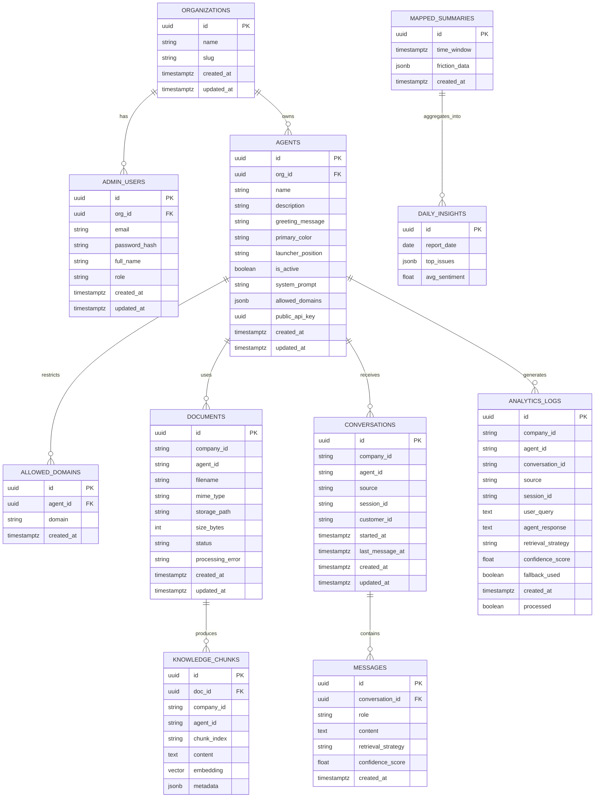

# ER Diagram

## Notes
- `DOCUMENTS` and `KNOWLEDGE_CHUNKS` store the retrieval corpus.
- `CONVERSATIONS`, `MESSAGES`, and `ANALYTICS_LOGS` support analytics and auditability.
- `ALLOWED_DOMAINS` enforces widget usage restrictions for production websites.
