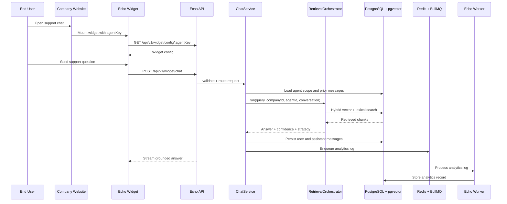
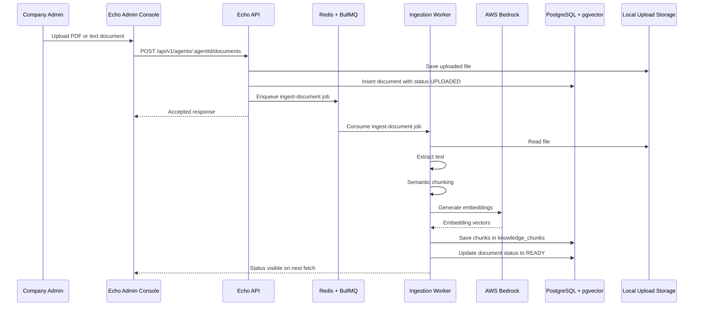

# Sequence Diagram

## Main Support Query Flow

```mermaid
sequenceDiagram
    participant EndUser as End User
    participant Website as Company Website
    participant Widget as Echo Widget
    participant API as Echo API
    participant ChatService as ChatService
    participant Retrieval as RetrievalOrchestrator
    participant DB as PostgreSQL + pgvector
    participant Queue as Redis + BullMQ
    participant Worker as Echo Worker

    EndUser->>Website: Open support chat
    Website->>Widget: Mount widget with agentKey
    Widget->>API: GET /api/v1/widget/config/:agentKey
    API-->>Widget: Widget config

    EndUser->>Widget: Send support question
    Widget->>API: POST /api/v1/widget/chat
    API->>ChatService: validate + route request
    ChatService->>DB: Load agent scope and prior messages
    ChatService->>Retrieval: run(query, companyId, agentId, conversation)
    Retrieval->>DB: Hybrid vector + lexical search
    DB-->>Retrieval: Retrieved chunks
    Retrieval-->>ChatService: Answer + confidence + strategy
    ChatService->>DB: Persist user and assistant messages
    ChatService->>Queue: Enqueue analytics log
    API-->>Widget: Stream grounded answer
    Queue->>Worker: Process analytics log
    Worker->>DB: Store analytics record
```

## Document Ingestion Flow

```mermaid
sequenceDiagram
    participant Admin as Company Admin
    participant Frontend as Echo Admin Console
    participant API as Echo API
    participant Queue as Redis + BullMQ
    participant Worker as Ingestion Worker
    participant Bedrock as AWS Bedrock
    participant DB as PostgreSQL + pgvector
    participant Disk as Local Upload Storage

    Admin->>Frontend: Upload PDF or text document
    Frontend->>API: POST /api/v1/agents/:agentId/documents
    API->>Disk: Save uploaded file
    API->>DB: Insert document with status UPLOADED
    API->>Queue: Enqueue ingest-document job
    API-->>Frontend: Accepted response

    Queue->>Worker: Consume ingest-document job
    Worker->>Disk: Read file
    Worker->>Worker: Extract text
    Worker->>Worker: Semantic chunking
    Worker->>Bedrock: Generate embeddings
    Bedrock-->>Worker: Embedding vectors
    Worker->>DB: Save chunks in knowledge_chunks
    Worker->>DB: Update document status to READY
    Worker-->>Frontend: Status visible on next fetch
```
