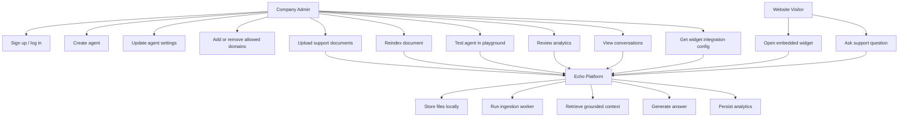

# Use Case Diagram

## Actors
- Company Admin: manages workspace, agents, knowledge base, analytics, and widget rollout.
- Website Visitor: interacts with the public support widget on the company website.

## Primary Use Cases
- Register and authenticate a company admin.
- Create and configure multiple support agents.
- Upload and reindex knowledge documents.
- Test support quality in the playground.
- Deploy an embeddable support widget.
- View analytics and past conversations.
- Receive grounded customer support answers from uploaded documents.
